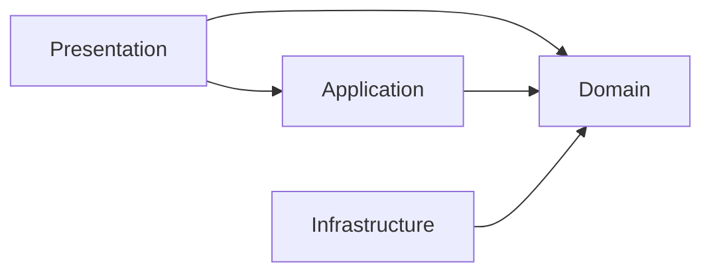

# Documentation du projet TicTacToe

Ce document decrit l'architecture, la structure et les commandes principales du projet.

## Vue d'ensemble

Le projet est un monorepo Flutter base sur **Melos**. L'application mobile se trouve dans `apps/flutter_app`.
L'architecture suit les principes **Clean Architecture** et une organisation **feature-first**.

## Architecture

Chaque feature est organisee en couches:

- **Domain**: regles metier et entites immuables.
- **Application**: use cases et orchestration.
- **Infrastructure**: implementations concretes (depots, services).
- **Presentation**: ecrans, widgets, et state management.

Le module `features/rules` contient la logique de jeu pure Dart, sans dependances Flutter.

### Principes clefs

- **Independance du domain**: pas de dependance Flutter dans `domain/` et `rules/`.
- **Use cases uniques**: chaque use case fait une seule action metier.
- **Infrastructure interchangeable**: implementations changeables sans toucher au domain.
- **Presentation fine**: pas de logique metier lourde dans les widgets.

### Flux de dependances



### Exemple de flux (game)

1. L'UI declenche une action (ex: jouer un coup).
2. Le provider appelle un use case.
3. Le use case utilise un repository (interface domain).
4. L'infrastructure execute l'operation (rules, persistence).
5. Le resultat remonte vers l'UI.

### Cartographie des dossiers par couche

- **Domain**: `features/*/domain/` + `features/rules/domain/`
- **Application**: `features/*/application/`
- **Infrastructure**: `features/*/infrastructure/`
- **Presentation**: `features/*/presentation/` + `core/presentation/`

### Regles de dependances

- `presentation` depend de `application` et `domain`.
- `application` depend de `domain`.
- `infrastructure` depend de `domain`.
- `domain` ne depend de rien d'autre.

### Regles vs Game

- `rules` = logique metier pure (mouvements, regles, IA).
- `game` = orchestration + UI.
- `game` depend de `rules`, jamais l'inverse.

### Gestion d'erreurs

Le projet utilise **result_dart** pour une gestion d'erreurs fonctionnelle :
- Pattern `Either<Failure, Success>` pour les operations pouvant echouer
- Pas d'exceptions pour le flux metier
- Les failures sont typees et documentees dans `domain/failures/`
- Les use cases retournent des `Result<T>` ou `AsyncResult<T>`

## Structure des dossiers

```
tictactoe/
├── apps/
│   └── flutter_app/
│       ├── lib/
│       │   ├── core/         # UI partagee, router, l10n, services
│       │   │   ├── application/  # AudioController, services core
│       │   │   ├── presentation/ # Theme, widgets, l10n
│       │   │   └── di/          # Dependency injection
│       │   └── features/     # Features (game, rules, settings)
│       │       ├── game/     # UI + use cases du jeu
│       │       ├── rules/    # Logique pure (board, engine, AI)
│       │       └── settings/ # Preferences utilisateur
│       └── assets/
│           └── audio/        # Musique et SFX
├── docs/                      # Documentation
├── melos.yaml                 # Scripts monorepo
└── pubspec.yaml               # Workspace
```

## Stack technique

- **Flutter** + **Dart**
- **Riverpod v3** (NotifierProvider) pour le state management
- **GoRouter** pour la navigation avec routes typees
- **Freezed** pour l'immutabilite des entites et value objects
- **result_dart** pour la gestion d'erreurs fonctionnelle (Either pattern)
- **just_audio** pour l'audio (musique + SFX)
- **flutter_animate** pour les animations
- **flutter_localizations** + **intl** pour la localisation (i18n)
- **shared_preferences** pour la persistence locale
- **mocktail** pour les tests avec mocks
- **Melos** + **FVM** pour le monorepo et la gestion de versions Flutter

## Installation et setup

Depuis la racine du repo:

```bash
dart pub global activate fvm
fvm dart pub global activate melos

cd apps/flutter_app
fvm install
cd ../..

melos prepare
```

`melos prepare` lance:
- `melos bootstrap` (deps)
- `melos gen` (build_runner)
- `melos l10n` (localisations)

## Commandes utiles (Melos)

Depuis la racine:

```bash
melos bootstrap     # Installation des dependances
melos gen           # Generation de code (build_runner)
melos gen:watch     # Generation en watch mode
melos l10n          # Generation des fichiers de localisation
melos test          # Tests
melos test:coverage # Tests + couverture
melos analyze       # Analyse statique
melos format        # Formatage
melos clean         # Nettoyage
```

## Execution de l'app

```bash
cd apps/flutter_app
fvm flutter run
```

## Tests

```bash
melos test
```

## Localisation

Les fichiers de traduction sont generes par `flutter gen-l10n`.
Assurez-vous d'executer `melos l10n` apres toute modification des fichiers ARB.

## Features detaillees

### Systeme de match

L'application supporte un systeme de match complet :
- **Best of 1/3/5** : L'utilisateur choisit le nombre de rounds a remporter
- **Sudden Death** : En cas d'egalite sur un match best-of, un round supplementaire departage
- **Tracking des rounds** : Affichage du score et de l'avancement (ex: "Round 2/3")
- **Overlays de resultat** :
  - Victoire de round (avec recap et bouton "Next Round")
  - Egalite de round
  - Victoire finale du match (avec confetti)

Implementation : `features/rules/services/match_engine.dart`

### Audio

Systeme audio complet avec `just_audio` :
- **Musique de fond** : Track "Les Champs Etoiles" en boucle
- **4 types de SFX** :
  - `place` : Placement d'un symbole
  - `invalid` : Coup invalide
  - `gameOver` : Fin de partie
  - `click` : Clic UI
- **Settings audio** :
  - Volume musique (0-100%)
  - Volume SFX (0-100%)
  - Mute global
  - Persistence avec `shared_preferences`

Implementation : `core/application/audio/audio_controller.dart`

### Localisation (i18n)

Support complet francais/anglais :
- **Fichiers ARB** : `lib/core/presentation/l10n/app_*.arb`
- **Generation automatique** : via `flutter gen-l10n` (commande `melos l10n`)
- **Switch dynamique** : Changement de langue dans Settings sans redemarrage
- **Couverture complete** : Tous les textes UI sont traduits

Les traductions sont accessibles via `AppLocalizations.of(context)`.

### Design system gaming

Theme dark moderne avec couleurs neon :
- **Palette de couleurs** :
  - Background : `#0F0F23` (dark blue)
  - Card : `#1A1A2E`
  - Cyan (X) : `#06B6D4`
  - Pink (O) : `#EC4899`
  - Purple (accent) : `#8B5CF6`
- **Composants reutilisables** :
  - `GamingActionButton` : Bouton avec gradient
  - `GamingGradientCard` : Card avec effet neon
  - `GamingScaffold` : Layout avec background anime
  - `GamingAppBar` / `GamingBackHeader` : Headers consistants
  - `GamingIconButton` : Bouton icone avec effet hover
- **Gradients** : Gradients pre-definis pour joueurs (X, O, local mode, AI)

Implementation : `core/presentation/theme/gaming_theme.dart`

### Responsive design

Support multi-devices avec breakpoints adaptatifs :
- **Breakpoints** (definis dans `layout_tokens.dart`) :
  - Mobile : < 600px
  - Tablette : 600-1024px
  - Desktop : > 1024px
- **Orientations** : Portrait et paysage
- **Layouts adaptatifs** :
  - Grille de jeu scalable
  - UI reorganisee selon l'espace disponible
  - Spacing et padding ajustes

### Animations

Animations riches avec `flutter_animate` :
- **Confetti** : Particules animees sur victoire (`ConfettiEffect`)
- **Titre anime** : Effet neon pulse sur homepage (`AnimatedTitle`)
- **Winning line** : Ligne animee traversant les symboles gagnants (`WinningLinePainter`)
- **Transitions** : Fade, slide, scale sur navigation et overlays
- **Hover effects** : Sur boutons et cards

### IA (Adversaire)

Implementation d'une IA avec 3 niveaux :
- **Easy** : Joue aleatoirement (20% de coups optimaux)
- **Medium** : Equilibre entre aleatoire et optimal (60%)
- **Hard** : Quasi-parfait (95% de coups optimaux)

Algorithme : `ProbabilisticAI` avec Minimax + pourcentage d'erreur configurable.
Implementation : `features/rules/services/ai/probabilistic_ai.dart`

## UI/UX - Composants gaming

### Core widgets

| Widget | Description |
|--------|-------------|
| `GamingScaffold` | Layout principal avec background gradient anime |
| `GamingActionButton` | Bouton primaire avec gradient et effet glow |
| `GamingGradientCard` | Card avec bordure neon et shadow |
| `GamingAppBar` | AppBar avec titre centre et icone settings |
| `GamingBackHeader` | Header avec bouton retour + titre |
| `GamingIconButton` | Bouton icone circulaire avec effet hover |

### Game widgets

| Widget | Description |
|--------|-------------|
| `GameBoard` | Grille 3x3 interactive avec cells cliquables |
| `BoardCell` | Cellule individuelle avec X/O marks |
| `XMark` / `OMark` | Symboles animes avec couleurs neon |
| `WinningLinePainter` | Ligne de victoire animee (horizontal/vertical/diagonal) |
| `PlayerCard` | Card affichant joueur + score + indicateur tour |
| `PlayerAvatar` | Avatar circulaire avec symbole et gradient |
| `TurnIndicator` | Fleche animee indiquant le joueur actif |
| `RoundIndicator` | Badge "Round X/Y" |
| `SuddenDeathLabel` | Badge "Sudden Death" dore |

### Result overlays

| Overlay | Description |
|---------|-------------|
| `VictoryOverlay` | Ecran de victoire avec confetti + boutons |
| `DrawOverlay` | Ecran d'egalite |
| `RoundRecapOverlay` | Recap de round avec score + bouton "Next" |
| `MatchResultOverlay` | Resultat final du match |

## Notes pour contributeurs

- La logique de jeu pure Dart doit rester dans `features/rules`.
- Eviter de melanger les couches (presentation <-> domain).
- Preferer des use cases simples et testables.
- Utiliser `result_dart` pour la gestion d'erreurs (pas d'exceptions).
- Tous les textes UI doivent etre localises (ARB files).
- Les composants UI doivent utiliser le `GamingTheme` pour la consistance visuelle.
